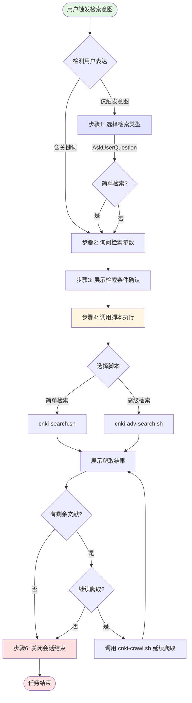

# CNKI 技能主流程



## 技能入口：交互式检索

**触发条件**：当用户表达以下意图时，应使用此技能：

| 用户表达示例 | 触发类型 | 已含信息 |
|--------------|----------|----------|
| "检索 CNKI 论文" | 直接指令 | - |
| "在知网上搜索人工智能" | 平台指定 | 关键词 |
| "查找关于机器学习的文献" | 间接意图 | 关键词 |
| "CNKI上有哪些关于深度学习的研究" | 询问式 | 关键词 |
| "帮我爬取知网数据" | 数据获取 | - |
| "搜索核心期刊关于大模型的论文" | 具体需求 | 关键词+筛选条件 |

**关键词识别**：CNKI、知网、论文检索、文献搜索、学术搜索、核心期刊、SCI/SSCI

**触发处理逻辑**：
- 如果用户表达中已包含检索关键词 → 直接进入步骤2询问其他参数
- 如果用户表达中只含触发意图 → 从步骤1开始完整流程

当检测到上述意图时，按以下流程处理：

### 步骤1：交互式选择检索类型

**执行逻辑**：提供两种检索模式让用户选择，简单检索适合快速查询，高级检索支持精确筛选。

**使用 AskUserQuestion 让用户选择检索类型**（唯一交互）：

```json
{
  "question": "请选择检索类型",
  "header": "检索类型",
  "options": [
    {"label": "简单检索", "description": "快速检索，无时间/核心期刊限制"},
    {"label": "高级检索", "description": "支持时间范围、核心期刊筛选"}
  ],
  "multiSelect": false
}
```

---

### 步骤2：询问检索参数

**执行逻辑**：一次性收集所有必要参数，避免多次交互打断用户。根据检索类型只询问相关参数。

**不要使用AskUserQuestion工具，直接一次性询问所有参数**：
- 检索关键词
- 时间范围（仅高级检索）
- 来源类别/是否核心期刊（仅高级检索）
- 爬取数量

**异常处理**：用户输入格式问题时，给出明确示例并重新询问。

---

### 步骤3：展示检索条件并执行

**执行逻辑**：在执行前让用户确认所有参数，避免因误解导致需要重新检索。确认后立即开始执行，不需要额外等待用户输入。

**输出格式**：

```
━━━━━━━━━━━━━━━━━━━━━━━━━━━━━━━━━━━━━━━━
📋 检索条件确认
━━━━━━━━━━━━━━━━━━━━━━━━━━━━━━━━━━━━━━━━
检索类型: 高级检索
检索关键词: XXX
时间范围: 最近2年 (2024-2025)
来源类别: 仅核心期刊
爬取数量: 50 篇
━━━━━━━━━━━━━━━━━━━━━━━━━━━━━━━━━━━━━━━━

正在开始检索...
```

---

### 步骤4：调用脚本并展示结果

**执行逻辑**：根据检索条件调用对应的自动化脚本，脚本会处理浏览器交互、结果提取、翻页等复杂操作。脚本执行期间保持浏览器会话打开，便于后续延续爬取。

**异常处理**：
- 脚本执行失败 → [故障排查指南](reference/troubleshooting.md)
- 参数错误 → [脚本文档](reference/scripts.md)
- 元素定位问题 → [手动操作参考](reference/manual-operations.md)

**脚本调用**（详细参数说明见 [脚本文档](reference/scripts.md)）：

| 检索类型 | 脚本 | 基本用法 |
|----------|------|----------|
| 简单检索 | `cnki-search.sh` | `cnki-search.sh <keyword> [count] [output_dir]` |
| 高级检索 | `cnki-adv-search.sh` | `cnki-adv-search.sh <keyword> [-s start] [-e end] [-c] [-n count]` |

**完整调用示例**（需 cd 到脚本目录）：
```bash
cd {baseDir}/.claude/skills/cnki-search-agent-browser
bash scripts/cnki-search.sh "关键词" 15 {baseDir}/outputs
```

**完成后展示结果摘要**，

```
━━━━━━━━━━━━━━━━━━━━━━━━━━━━━━━━━━━━━━━━
📊 爬取总结报告
━━━━━━━━━━━━━━━━━━━━━━━━━━━━━━━━━━━━━━━━
检索关键词: XXX
相关文献总数: 约 XXXX 篇
本次爬取: XX 篇
未爬取: XXXX 篇
━━━━━━━━━━━━━━━━━━━━━━━━━━━━━━━━━━━━━━━━
```
如果还有未爬取的文献，执行步骤 5 询问用户是否继续爬取。否则，执行步骤 6 结束任务。

### 步骤5：使用 AskUserQuestion 询问是否继续爬取剩余文献

**如需继续爬取**：使用当前会话，继续调用 `cnki-crawl.sh` 脚本延续爬取。

**职责分工**：
- **Skill 层（大模型）**：理解用户意图、读取状态文件、计算目标参数
- **脚本层（执行）**：跳转到指定页、跳过指定条数、提取数据、输出状态

**状态文件位置说明**：
- 状态文件位于 `{baseDir}/outputs/.cnki_state.json`（项目根目录的 outputs/）
- 使用 `Bash cat {baseDir}/outputs/.cnki_state.json` 读取

**状态文件格式**：
```json
{
  "keyword": "关键词",
  "total_collected": 10,
  "current_page": 1,
  "items_per_page": 20,
  "timestamp": "2026-02-03T12:34:56Z"
}
```

**参数计算逻辑**（从状态文件读取）：
```bash
# 1. 使用 Bash 工具读取状态文件
Bash cat {baseDir}/outputs/.cnki_state.json

# 2. 从输出中提取必要信息
EXISTING_COUNT=10   # 从 .total_collected 获取
CURRENT_PAGE=1      # 从 .current_page 获取
ITEMS_PER_PAGE=20   # 从 .items_per_page 获取

# 3. 计算目标页码和页内跳过数
TARGET_PAGE=$((EXISTING_COUNT / ITEMS_PER_PAGE + 1))   # 10/20+1 = 1
SKIP_IN_PAGE=$((EXISTING_COUNT % ITEMS_PER_PAGE))     # 10%20 = 10
START_IDX=$((EXISTING_COUNT + 1))                      # 11
```

**新参数说明**：
- `--target-page`: 目标页码（从1开始），由 Skill 层从状态文件计算得出
- `--skip-in-page`: 当前页内需要跳过的条数，由 Skill 层从状态文件计算得出
- `--count`: 本次要爬取的数量
- `--start-idx`: 输出文件的起始序号（= 已爬取数量 + 1）

**调用示例**：
```bash
# 已爬取10篇，每页20条，继续爬30篇
# Skill 从状态文件读取: total_collected=10, current_page=1, items_per_page=20
# Skill 计算: target_page=1, skip_in_page=10, start_idx=11
cd {baseDir}/.claude/skills/cnki-search-agent-browser
bash scripts/cnki-crawl.sh cnki {baseDir}/outputs "关键词" \
  --target-page 1 \
  --skip-in-page 10 \
  --count 30 \
  --start-idx 11
```

---

### 步骤6：结束任务

**执行逻辑**：用户确认不再需要继续爬取后，关闭浏览器会话释放资源，清理临时状态文件，并简要总结此次爬取任务。

**关闭会话**：
```bash
npx agent-browser --session cnki close 2>/dev/null || true

npx agent-browser --session cnki-adv close 2>/dev/null || true
```

**清理临时文件**：
```bash
rm -f "{baseDir}/outputs/.cnki_state.json" 2>/dev/null || true
```

---

# CNKI 操作约束

**关键约束**（违反会导致操作失败，详见 [完整约束说明](reference/constraints.md)）：

1. **必须使用有头模式**：`--headed` 参数（无头模式会被检测）
2. **必须使用 session**：`--session` 参数启动会话
3. **元素 ref 动态变化**：可执行 `snapshot -i`（返回交互元素） 或 `snapshot`（返回全部元素） 获取最新 ref

---

## 参考文档

| 文档 | 说明 |
|------|------|
| [操作约束详解](reference/constraints.md) | CNKI 操作的完整约束列表和原因说明 |
| [脚本使用文档](reference/scripts.md) | 所有脚本的参数说明和使用示例 |
| [故障排查指南](reference/troubleshooting.md) | 常见错误及解决方案 |
| [手动操作参考](reference/manual-operations.md) | 底层操作命令、翻页、结果提取、调试技巧 |
