# CNKI 技能主流程

作为**主智能体（指挥官）**，协调浏览器自动化、结果提取、文件保存和 WPS 云盘上传。

## 涉及的组件

| 组件 | 类型 | 角色 | 文件位置 |
|------|------|------|----------|
| `agent-browser` | Skill | 浏览器自动化工具 | `.claude\skills\agent-browser\SKILL.md` |
| `cnki-*.sh` | Script | CNKI 操作脚本 | `$CLAUDE_PROJECT_DIR/.claude/skills/cnki-search-agent-browser/scripts/` |
| `wps-file-upload` | Skill | WPS 云盘上传 | `.claude/skills/wps-file-upload/SKILL.md` |

## 输出路径规范

| 输出类型 | 路径 | 说明 |
|----------|------|------|
| 检索结果 | `$CLAUDE_PROJECT_DIR/outputs/cnki-search/` | JSON + Markdown 格式 |
| WPS 云盘 | `CC-datas/cnki-search/` | 自动上传同步 |

> **路径规范**：使用 `$CLAUDE_PROJECT_DIR` 环境变量，确保跨工作目录的可靠路径解析。

```mermaid
flowchart TD
    Start([用户触发检索意图]) --> Detect{检测用户表达}
    Detect -->|含关键词| ParamStep[步骤2: 询问检索参数]
    Detect -->|仅触发意图| TypeStep[步骤1: 选择检索类型]

    TypeStep -->|AskUserQuestion| Simple{简单检索?}
    Simple -->|是| ParamStep
    Simple -->|否| ParamStep

    ParamStep --> Confirm[步骤3: 展示检索条件确认]
    Confirm --> Execute[步骤4: 调用脚本执行]

    Execute --> Script{选择脚本}
    Script -->|简单检索| SearchScript[cnki-search.sh]
    Script -->|高级检索| AdvSearchScript[cnki-adv-search.sh]

    SearchScript --> Result[展示爬取结果]
    AdvSearchScript --> Result

    Result --> HasRemaining{有剩余文献?}
    HasRemaining -->|是| Continue{继续爬取?}
    HasRemaining -->|否| EndStep[步骤6: 关闭会话结束]

    Continue -->|是| CrawlStep[调用 cnki-crawl.sh 延续爬取]
    CrawlStep --> Result

    Continue -->|否| EndStep
    EndStep --> End([任务结束])

    style Start fill:#e1f5e1
    style End fill:#ffe1e1
    style TypeStep fill:#e1e5ff
    style Execute fill:#fff5e1
    style EndStep fill:#ffe1e1
```



## 技能入口：交互式检索

**触发条件**：当用户表达以下意图时，应使用此技能：

| 用户表达示例 | 触发类型 | 已含信息 |
|--------------|----------|----------|
| "检索 CNKI 论文" | 直接指令 | - |
| "在知网上搜索人工智能" | 平台指定 | 关键词 |
| "查找关于机器学习的文献" | 间接意图 | 关键词 |
| "CNKI上有哪些关于深度学习的研究" | 询问式 | 关键词 |
| "帮我爬取知网数据" | 数据获取 | - |
| "搜索核心期刊关于大模型的论文" | 具体需求 | 关键词+筛选条件 |

**关键词识别**：CNKI、知网、论文检索、文献搜索、学术搜索、核心期刊、SCI/SSCI

**触发处理逻辑**：
- 如果用户表达中已包含检索关键词 → 直接进入步骤2询问其他参数
- 如果用户表达中只含触发意图 → 从步骤1开始完整流程

当检测到上述意图时，按以下流程处理：

### 步骤1：交互式选择检索类型

**执行逻辑**：提供两种检索模式让用户选择，简单检索适合快速查询，高级检索支持精确筛选。

**使用 AskUserQuestion 让用户选择检索类型**（唯一交互）：

```json
{
  "question": "请选择检索类型",
  "header": "检索类型",
  "options": [
    {"label": "简单检索", "description": "快速检索，无时间/核心期刊限制"},
    {"label": "高级检索", "description": "支持时间范围、核心期刊筛选"}
  ],
  "multiSelect": false
}
```

---

### 步骤2：询问检索参数

**执行逻辑**：一次性收集所有必要参数，避免多次交互打断用户。根据检索类型只询问相关参数。

**不要使用AskUserQuestion工具，直接一次性询问所有参数**：
- 检索关键词
- 时间范围（仅高级检索）
- 来源类别/是否核心期刊（仅高级检索）
- 爬取数量

**异常处理**：用户输入格式问题时，给出明确示例并重新询问。

---

### 步骤3：展示检索条件并执行

**执行逻辑**：在执行前让用户确认所有参数，避免因误解导致需要重新检索。确认后立即开始执行，不需要额外等待用户输入。

**输出格式**：

```
━━━━━━━━━━━━━━━━━━━━━━━━━━━━━━━━━━━━━━━━
📋 检索条件确认
━━━━━━━━━━━━━━━━━━━━━━━━━━━━━━━━━━━━━━━━
检索类型: 高级检索
检索关键词: XXX
时间范围: 最近2年 (2024-2025)
来源类别: 仅核心期刊
爬取数量: 50 篇
━━━━━━━━━━━━━━━━━━━━━━━━━━━━━━━━━━━━━━━━

正在开始检索...
```

---

### 步骤4：调用脚本并展示结果

**执行逻辑**：根据检索条件调用对应的自动化脚本，脚本会处理浏览器交互、结果提取、翻页等复杂操作。脚本执行期间保持浏览器会话打开，便于后续延续爬取。

**执行前预检查**（推荐）：

```bash
# 1. 检查 agent-browser 版本
npx agent-browser --version

# 2. 检查是否有残留会话
npx agent-browser session list

# 3. 清理残留会话（如存在）
npx agent-browser --session cnki close 2>/dev/null || true
npx agent-browser --session cnki-adv close 2>/dev/null || true

# 4. 检查环境变量（Windows 特别注意）
echo $AGENT_BROWSER_HOME  # 应显示有效的路径

# 5. 检查是否为 Linux 无图形界面环境（重要！）
if [[ "$OSTYPE" == "linux-gnu"* ]] && ! xhost > /dev/null 2>&1; then
    echo "⚠️  检测到无图形界面环境，需要使用 xvfb-run"
    if ! command -v xvfb-run &> /dev/null; then
        echo "正在安装 xvfb..."
        sudo apt install -y xvfb
    fi
    export USE_XVFB=true
fi
```

**异常处理**：
- 脚本执行失败 → [故障排查指南](reference/troubleshooting.md)
- 参数错误 → [脚本文档](reference/scripts.md)
- 元素定位问题 → [手动操作参考](reference/manual-operations.md)
- **Daemon 启动失败** → 使用以下备选方案：

#### 备选方案 A：使用 CDP 连接

```bash
# 1. 手动启动 Chrome（远程调试模式）
"C:\Program Files\Google\Chrome\Application\chrome.exe" --remote-debugging-port=9222

# 2. 修改脚本命令，添加 --cdp 参数
cd $CLAUDE_PROJECT_DIR/.claude/skills/cnki-search-agent-browser/scripts
bash cnki-search.sh "关键词" 15 $CLAUDE_PROJECT_DIR/outputs/cnki-search --cdp 9222
```

#### 备选方案 B：连接现有浏览器

```bash
# 1. 使用 connect 命令代替 open
npx agent-browser connect 9222

# 2. 检查连接状态
npx agent-browser session list
```

**脚本调用**（详细参数说明见 [脚本文档](reference/scripts.md)）：

| 检索类型 | 脚本 | 基本用法 |
|----------|------|----------|
| 简单检索 | `cnki-search.sh` | `cnki-search.sh <keyword> [count] [output_dir]` |
| 高级检索 | `cnki-adv-search.sh` | `cnki-adv-search.sh <keyword> [-s start] [-e end] [-c] [-n count]` |

**完整调用示例**（需 cd 到脚本目录）：

##### 方式 1：使用环境自适应包装脚本（推荐）

```bash
cd $CLAUDE_PROJECT_DIR/.claude/skills/cnki-search-agent-browser/scripts
# 包装脚本会自动检测环境并选择合适的执行方式
bash cnki-search-wrapper.sh cnki-search.sh "关键词" 15
bash cnki-search-wrapper.sh cnki-adv-search.sh "AI 伦理" -s 2022 -e 2025 -c -n 20
```

**优势**：
- 自动检测是否有图形界面
- Linux 无 GUI 环境自动使用 xvfb-run
- Windows/macOS/Linux Desktop 环境直接执行
- 无需手动判断环境

##### 方式 2：直接调用脚本

```bash
# Linux 无图形界面环境（手动使用 xvfb-run）
cd $CLAUDE_PROJECT_DIR/.claude/skills/cnki-search-agent-browser/scripts
xvfb-run -a bash cnki-search.sh "关键词" 15 $CLAUDE_PROJECT_DIR/outputs/cnki-search

# 有图形界面环境（Windows/macOS/Linux Desktop）
cd $CLAUDE_PROJECT_DIR/.claude/skills/cnki-search-agent-browser/scripts
bash cnki-search.sh "关键词" 15 $CLAUDE_PROJECT_DIR/outputs/cnki-search
```

**完成后展示结果摘要**：

```
━━━━━━━━━━━━━━━━━━━━━━━━━━━━━━━━━━━━━━━━
📊 爬取总结报告
━━━━━━━━━━━━━━━━━━━━━━━━━━━━━━━━━━━━━━━━
检索关键词: XXX
相关文献总数: 约 XXXX 篇
本次爬取: XX 篇
未爬取: XXXX 篇
━━━━━━━━━━━━━━━━━━━━━━━━━━━━━━━━━━━━━━━━

📁 输出文件:
- 本地: outputs/cnki-search/{keyword}_{timestamp}.json
- 本地: outputs/cnki-search/{keyword}_{timestamp}.md
- WPS云盘: CC-datas/cnki-search/{filename}.md (文件ID: {id}, 大小: {size} 字节)
```

### 结果文件处理

脚本执行完成后，会将结果保存到 `$CLAUDE_PROJECT_DIR/outputs/cnki-search/` 目录：

**输出文件格式**：

- `{keyword}_{timestamp}.json` - JSON 格式数据（程序处理用）
- `{keyword}_{timestamp}.md` - Markdown 格式报告（人工查看用）

**自动上传到 WPS 云盘**：

使用 `wps-file-upload` skill 自动将 Markdown 报告上传到 `CC-datas/cnki-search/` 路径：

```python
from pathlib import Path

# 输出目录配置
output_dir = Path("$CLAUDE_PROJECT_DIR") / "outputs" / "cnki-search"
output_dir.mkdir(parents=True, exist_ok=True)

# 获取脚本输出的 Markdown 文件（匹配关键词和时间戳）
md_files = list(output_dir.glob(f"{keyword}_*.md"))
if md_files:
    latest_md = max(md_files, key=lambda p: p.stat().st_mtime)

    # 调用 wps-file-upload skill 上传
    wps_upload_result = Skill(
        skill="wps-file-upload",
        args=f"--file {latest_md} --path CC-datas/cnki-search --create-path"
    )

    # 上传结果包含文件ID、名称、大小等信息
```

**错误处理**：如果 WPS 上传失败，仅记录警告，不影响检索任务完成状态。本地文件始终保存成功。

如果还有未爬取的文献，执行步骤 5 询问用户是否继续爬取。否则，执行步骤 6 结束任务。

### 步骤5：使用 AskUserQuestion 询问是否继续爬取剩余文献

**如需继续爬取**：使用当前会话，继续调用 `cnki-crawl.sh` 脚本延续爬取。

**职责分工**：

- **Skill 层（大模型）**：理解用户意图、读取状态文件、计算目标参数
- **脚本层（执行）**：跳转到指定页、跳过指定条数、提取数据、输出状态

**状态文件位置说明**：

- 状态文件位于 `$CLAUDE_PROJECT_DIR/outputs/.cnki_state.json`
- 使用 `Bash cat $CLAUDE_PROJECT_DIR/outputs/.cnki_state.json` 读取

**状态文件格式**：
```json
{
  "keyword": "关键词",
  "total_collected": 10,
  "current_page": 1,
  "items_per_page": 20,
  "timestamp": "2026-02-03T12:34:56Z"
}
```

**参数计算逻辑**（从状态文件读取）：
```bash
# 1. 使用 Bash 工具读取状态文件
Bash cat $CLAUDE_PROJECT_DIR/outputs/.cnki_state.json

# 2. 从输出中提取必要信息
EXISTING_COUNT=10   # 从 .total_collected 获取
CURRENT_PAGE=1      # 从 .current_page 获取
ITEMS_PER_PAGE=20   # 从 .items_per_page 获取

# 3. 计算目标页码和页内跳过数
TARGET_PAGE=$((EXISTING_COUNT / ITEMS_PER_PAGE + 1))   # 10/20+1 = 1
SKIP_IN_PAGE=$((EXISTING_COUNT % ITEMS_PER_PAGE))     # 10%20 = 10
START_IDX=$((EXISTING_COUNT + 1))                      # 11
```

**新参数说明**：
- `--target-page`: 目标页码（从1开始），由 Skill 层从状态文件计算得出
- `--skip-in-page`: 当前页内需要跳过的条数，由 Skill 层从状态文件计算得出
- `--count`: 本次要爬取的数量
- `--start-idx`: 输出文件的起始序号（= 已爬取数量 + 1）

**调用示例**：
```bash
# 已爬取10篇，每页20条，继续爬30篇
# Skill 从状态文件读取: total_collected=10, current_page=1, items_per_page=20
# Skill 计算: target_page=1, skip_in_page=10, start_idx=11
cd $CLAUDE_PROJECT_DIR/.claude/skills/cnki-search-agent-browser/scripts
bash cnki-crawl.sh cnki $CLAUDE_PROJECT_DIR/outputs/cnki-search "关键词" \
  --target-page 1 \
  --skip-in-page 10 \
  --count 30 \
  --start-idx 11
```

---

### 步骤6：结束任务

**执行逻辑**：用户确认不再需要继续爬取后，关闭浏览器会话释放资源，清理临时状态文件，并简要总结此次爬取任务。

**关闭会话前检查**（增强版）：

```bash
# 1. 检查活动会话列表
npx agent-browser session list

# 2. 根据结果关闭对应会话
npx agent-browser --session cnki close 2>/dev/null || true
npx agent-browser --session cnki-adv close 2>/dev/null || true

# 3. 等待进程完全退出（可选但推荐）
sleep 2

# 4. 验证会话已关闭
npx agent-browser session list
```

**清理临时文件**：

```bash
# 清理状态文件
rm -f "$CLAUDE_PROJECT_DIR/outputs/.cnki_state.json" 2>/dev/null || true

# 清理残留的 socket 文件（Windows 兼容）
rm -f "$HOME/.agent-browser/"*.sock 2>/dev/null || true
rm -f "$HOME/.agent-browser/"*.pid 2>/dev/null || true
```

**清理失败时的备选方案**：

```bash
# 如果正常关闭失败，使用环境变量指定位置后重试
AGENT_BROWSER_HOME="$HOME/.agent-browser" npx agent-browser --session cnki close

# 或直接查找并终止残留进程（最后手段）
taskkill /F /IM chrome.exe 2>/dev/null || true
```

---

# 环境配置与故障排查

## 环境变量（可选）

| 变量 | 用途 | 示例 |
|------|------|------|
| `AGENT_BROWSER_HOME` | 指定 agent-browser 路径 | `C:\Users\Username\.agent-browser` |
| `AGENT_BROWSER_SESSION` | 设置默认会话名 | `cnki` |
| `AGENT_BROWSER_EXECUTABLE_PATH` | 自定义 Chrome 路径 | `C:\Program Files\...\chrome.exe` |

### 常见问题快速索引

| 问题 | 快速方案 | 详细文档 |
|------|----------|----------|
| Daemon 启动失败 | 使用 `--cdp 9222` 或清理残留文件 | [troubleshooting.md - Daemon故障](reference/troubleshooting.md#0-daemon-启动失败windows-环境) |
| 元素定位失败 | 使用 `snapshot -i` 获取最新 ref | [troubleshooting.md - 元素定位](reference/troubleshooting.md#2-元素定位问题) |
| 翻页操作无效 | 使用 `snapshot + click` 代替 `eval` | [troubleshooting.md - 翻页问题](reference/troubleshooting.md#3-翻页操作问题) |
| 检索等待超时 | 使用 `sleep + grep` 循环检测 | [troubleshooting.md - 检索问题](reference/troubleshooting.md#4-检索结果问题) |

**调试命令**：
```bash
# 检查会话状态
npx agent-browser session list

# 查看控制台日志
npx agent-browser --session cnki --headed console

# 截图调试
npx agent-browser --session cnki --headed screenshot debug.png
```

---

# CNKI 操作约束

**关键约束**（违反会导致操作失败，详见 [完整约束说明](reference/constraints.md)）：

1. **必须使用有头模式**：`--headed` 参数（无头模式会被检测）
2. **必须使用 session**：`--session` 参数启动会话
3. **元素 ref 动态变化**：可执行 `snapshot -i`（返回交互元素） 或 `snapshot`（返回全部元素） 获取最新 ref

---

## 参考文档

| 文档 | 说明 |
|------|------|
| [操作约束详解](reference/constraints.md) | CNKI 操作的完整约束列表和原因说明 |
| [脚本使用文档](reference/scripts.md) | 所有脚本的参数说明和使用示例 |
| [故障排查指南](reference/troubleshooting.md) | 常见错误及解决方案 |
| [手动操作参考](reference/manual-operations.md) | 底层操作命令、翻页、结果提取、调试技巧 |
