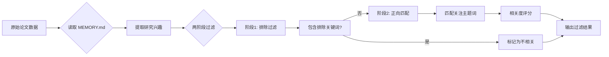
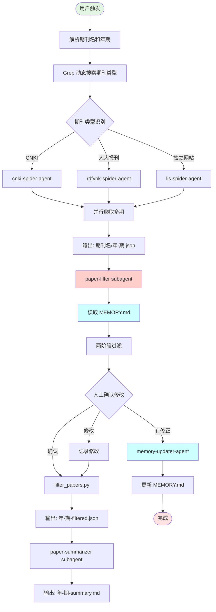
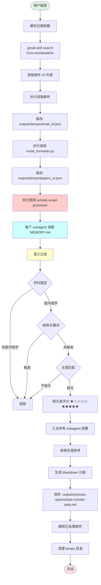
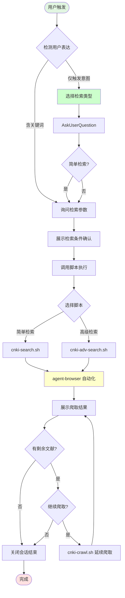
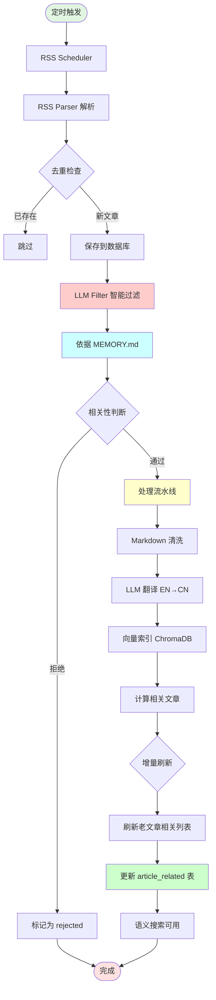
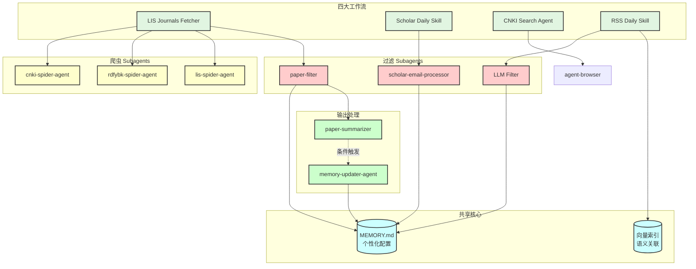

# LIS Scholar Skill Toolkit

面向图书馆学领域的个性化学术文献追踪工具集，基于 Claude Code Skills 框架构建。

## 概述

本项目包含四套独立的工作流，均通过 **MEMORY.md** 实现个性化的文献过滤机制：

| 工作流 | 功能 | 触发方式 | 输出 |
|--------|------|----------|------|
| **lis-journals-fetcher** | 多源期刊论文追踪 | `获取期刊论文` / `/lis-journals-fetcher` | JSON + Markdown 总结 |
| **scholar-daily-skill** | Google Scholar 日报生成 | `生成scholar日报` / `/scholar-daily` | 每日 Markdown 日报 |
| **cnki-search-agent-browser** | CNKI 检索交互工具 | `检索 CNKI 论文` / 知网相关指令 | 论文 JSON 数据 |
| **rss-daily** | RSS 智能订阅追踪 | 定时任务 / API 触发 | 向量索引 + 语义搜索 |

---

## 核心机制：MEMORY.md 个性化过滤

所有工作流共享 `MEMORY.md` 作为个性化配置中心，实现智能论文过滤。

### MEMORY.md 结构

```markdown
# 研究兴趣关键词

## 学科领域
- 图书馆学
- 信息资源组织

## 关注主题词
- 知识组织、信息组织
- 元数据、资源描述
- 大模型、RAG、知识图谱
- 智慧图书馆、AI 应用

## 排除关键词
- 元宇宙
- 公共图书馆服务
- 阅读推广活动
```

### 过滤流程



---

## 工作流详解

### 1. LIS Journals Fetcher - 多源期刊论文追踪

#### 支持的期刊类型

| 类型 | 数量 | 爬虫方式 |
|------|------|----------|
| CNKI 期刊 | 15 种 | cnki-spider-agent |
| 人大报刊复印资料 | 3 种 | rdfybk-spider-agent |
| 独立网站期刊 | 1 种 | lis-spider-agent |

#### 完整流程



#### 数据文件流向

```
触发
  ↓
爬取 → outputs/{期刊名}/{年-期}.json (原始数据)
  ↓
过滤 → 同一文件添加 interest_match / relevance_score 字段
  ↓
筛选 → outputs/{期刊名}/{年-期}-filtered.json (仅相关论文)
  ↓
总结 → outputs/{期刊名}/{年-期}-summary.md (Markdown 报告)
```

---

### 2. Scholar Daily Skill - Google Scholar 日报生成

#### 完整流程



#### scholar-email-processor 过滤逻辑

| 优先级 | 过滤规则 | 说明 |
|--------|----------|------|
| 1 | 学科领域限定 | 必须属于图书馆学/信息资源组织领域 |
| 2 | 排除规则 | 元宇宙、公共图书馆服务等直接排除 |
| 3 | 主题匹配 | 与关注主题词（知识组织、大模型等）相关 |
| 4 | 相关度评分 | ★★★★★ 到 ★☆☆☆☆ |

---

### 3. CNKI Search Agent - CNKI 检索交互工具

#### 交互式流程



#### agent-browser 约束

| 约束 | 说明 |
|------|------|
| **有头模式** | `--headed` 参数（无头模式会被检测） |
| **Session 管理** | `--session` 参数启动会话 |
| **元素 ref** | 动态变化，需使用 `snapshot -i` 获取最新 ref |

---

### 4. RSS Daily Skill - RSS 智能订阅追踪

> https://github.com/xulei-shl/lis-rss-daily

#### 核心特点

| 特性 | 说明 |
|------|------|
| **自动抓取** | node-cron 定时抓取 RSS 源，支持并发控制 |
| **LLM 智能过滤** | 基于研究兴趣自动判断文章相关性 |
| **向量索引** | ChromaDB 语义向量存储 |
| **增量刷新** | 新文章自动触发老文章相关列表更新 |

#### 完整流程



#### 个人 Memory 共享机制

**相关文章缓存系统** (`article_related` 表)：

1. **增量刷新**：新文章处理完成后，自动找到相似老文章并刷新其相关列表
2. **周期性刷新**：定时刷新过期缓存（默认7天），优先刷新近期文章
3. **语义关联**：基于向量相似度构建"活的知识图谱"

---

## 共享架构图



---

## Subagent 列表

### 爬虫类 Subagents

| Subagent | 文件 | 作用 |
|----------|------|------|
| cnki-spider-agent | `.claude/agents/cnki-spider-agent.md` | CNKI 期刊爬取 |
| rdfybk-spider-agent | `.claude/agents/rdfybk-spider-agent.md` | 人大报刊复印资料爬取 |
| lis-spider-agent | `.claude/agents/lis-spider-agent.md` | 独立网站期刊爬取 |

### 过滤类 Subagents

| Subagent | 文件 | 作用 |
|----------|------|------|
| paper-filter | `.claude/agents/paper-filter.md` | 期刊论文智能过滤标注 |
| scholar-email-processor | `.claude/agents/scholar-email-processor.md` | Scholar 邮件论文过滤 |

### 总结类 Subagents

| Subagent | 文件 | 作用 |
|----------|------|------|
| paper-summarizer | `.claude/agents/paper-summarizer.md` | 生成论文总结报告 |

### 记忆更新类 Subagents

| Subagent | 文件 | 作用 |
|----------|------|------|
| memory-updater-agent | `.claude/agents/memory-updater-agent.md` | 智能更新 MEMORY.md |

---

### RSS Daily 模块

| 模块 | 文件 | 作用 |
|------|------|------|
| RSS Scheduler | `src/rss-scheduler.ts` | 定时抓取 RSS 源 |
| LLM Filter | `src/filter.ts` | 基于研究兴趣智能过滤 |
| Pipeline | `src/pipeline.ts` | 翻译、向量化、相关文章计算 |
| Vector Indexer | `src/vector/indexer.ts` | ChromaDB 向量索引服务 |
| Related Refresh | `src/related-scheduler.ts` | 增量刷新相关文章缓存 |

---

## 目录结构

```
lis-scholar-skill-toolkit/
├── .claude/
│   ├── skills/                    # Skill 工作流
│   │   ├── lis-journals-fetcher/  # 期刊论文获取
│   │   ├── scholar-daily-skill/   # Scholar 日报生成
│   │   ├── cnki-search-agent-browser/  # CNKI 检索
│   │   ├── gmail-skill/           # Gmail 访问
│   │   ├── agent-browser/         # 浏览器自动化
│   │   ├── json-canvas/           # Canvas 绘图
│   │   └── memory-updater/        # 记忆更新
│   └── agents/                    # Subagent 定义
│       ├── cnki-spider-agent.md
│       ├── rdfybk-spider-agent.md
│       ├── lis-spider-agent.md
│       ├── paper-filter.md
│       ├── scholar-email-processor.md
│       ├── paper-summarizer.md
│       └── memory-updater-agent.md
├── src/                           # RSS Daily 核心代码
│   ├── rss-scheduler.ts           # RSS 定时抓取
│   ├── filter.ts                  # LLM 智能过滤
│   ├── pipeline.ts                # 文章处理流水线
│   └── vector/                    # 向量索引服务
├── outputs/                       # 输出目录
│   ├── {期刊名}/                  # 期刊论文数据
│   ├── scholar-reports/           # Scholar 日报
│   └── temps/                     # 临时文件
├── MEMORY.md                      # 个性化配置（需用户创建）
└── README.md
```

---

## 快速开始

### 1. 创建 MEMORY.md

在项目根目录创建 `MEMORY.md` 文件，定义你的研究兴趣：

```markdown
# 研究兴趣关键词

## 学科领域
- 图书馆学
- 信息资源管理

## 关注主题词
- 知识组织
- 元数据
- 大模型
- RAG

## 排除关键词
- 元宇宙
```

### 2. 使用工作流

```bash
# 获取期刊论文
/lis-journals-fetcher

# 生成 Scholar 日报
/scholar-daily

# 检索 CNKI 论文
检索 CNKI 论文

# RSS 订阅（自动运行）
npm start
```